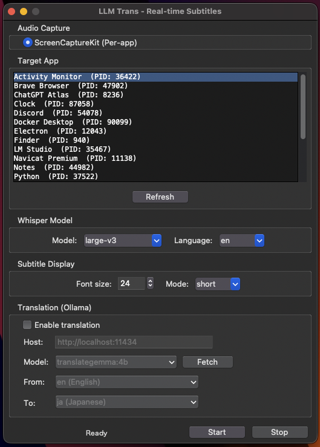

# LLM Trans

Real-time subtitle and translation app for macOS. Captures audio from any app using [ScreenCaptureKit](https://developer.apple.com/documentation/screencapturekit), transcribes with [faster-whisper](https://github.com/SYSTRAN/faster-whisper), and translates in real-time using local LLMs via [Ollama](https://ollama.com/).

<p align="center">
  
</p>

## Features

- **Per-app audio capture** — Uses ScreenCaptureKit to capture audio from a specific app (system-wide capture via BlackHole also supported)
- **Parallel transcription** — Two workers process overlapping chunks for seamless subtitles
- **Real-time translation** — Translate via local LLMs through Ollama (e.g., translategemma)
- **Subtitle overlay** — Always-on-top, draggable overlay with adjustable font size
- **Short / List mode** — Switch between latest-lines view and scrollable timestamped log
- **Persistent settings** — Automatically saves and restores your configuration

## Requirements

- **OS:** macOS 14 (Sonoma) or later
- **CPU:** Apple Silicon (M1/M2/M3/M4) recommended
- **Python:** 3.11+
- **Ollama:** Required only for the translation feature

## Setup

### 1. Clone

```bash
git clone https://github.com/kawayuta/llmtrans-whisper_subtitles_mac.git
cd llmtrans-whisper_subtitles_mac
```

### 2. Python environment

```bash
python3 -m venv venv
source venv/bin/activate
pip install -r requirements.txt
```

### 3. Build the ScreenCaptureKit helper

Required for per-app audio capture:

```bash
cd audio
swiftc capture_helper.swift -o capture_helper -framework ScreenCaptureKit -framework CoreMedia -framework AVFoundation
cd ..
```

> Requires Xcode Command Line Tools: `xcode-select --install`

### 4. Ollama (optional, for translation)

```bash
brew install ollama
ollama pull translategemma:4b
```

## Usage

### Launch

```bash
./run.sh
```

Or manually:

```bash
source venv/bin/activate
python main.py
```

### Steps

1. **Select audio capture method** — ScreenCaptureKit (per-app) or BlackHole (system audio)
2. **Select the target app** — Choose which app to capture audio from
3. **Configure Whisper** — Pick model size and audio language
4. **Enable translation (optional)** — Check "Enable translation", select source/target languages
5. **Click Start** — First run downloads the Whisper model, which may take a while

### Overlay controls

- **Drag** — Move the subtitle window by dragging
- **Scroll wheel** — Adjust font size
- **Right-click** — Switch display mode (short / list), change font size

## Audio capture methods

### ScreenCaptureKit (recommended)

Captures audio from a specific app only. Requires macOS Screen Recording permission on first launch.

### BlackHole

Captures system-wide audio via the [BlackHole](https://github.com/ExistentialAudio/BlackHole) virtual audio device. Requires separate installation and macOS audio configuration.

## License

[MIT](LICENSE)
